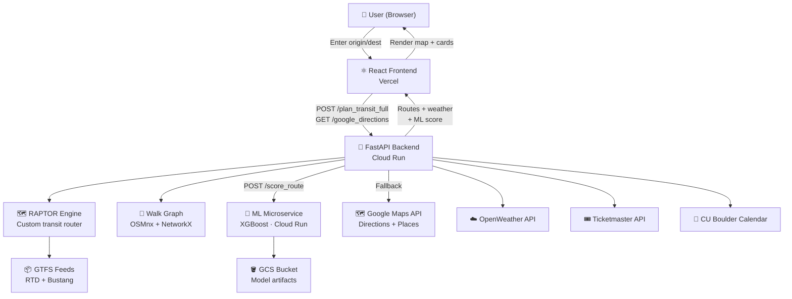

# 🚌 BoulderMove — Smart Multimodal Trip Planner

**Live demo → [bouldermove.vercel.app](https://bouldermove.vercel.app)**

BoulderMove is a full-stack trip planning app for Boulder, CO that combines real-time transit routing, live weather context, local event awareness, and an XGBoost ML model to predict whether your trip will arrive on time — all in one dashboard.


---

## What Makes This Interesting

Most routing apps just find the fastest path. BoulderMove layers on:

- **Custom RAPTOR transit engine** — implements the RAPTOR algorithm from scratch over RTD + Bustang GTFS feeds, 790k+ rows of stop times
- **Walk graph routing** — OSMnx-built pedestrian graph (38MB) with NetworkX shortest-path for walk-to-stop and stop-to-destination legs
- **XGBoost on-time prediction** — ML model trained on 6,000 synthetic trips using weather, transfer count, trip duration, time of day, and event proximity as features
- **Explainable ML breakdown** — each factor's penalty is shown to the user (rush hour −8%, snow −12%, etc.), mirroring the training formula
- **Live context** — OpenWeather API for current conditions, Ticketmaster + CU Boulder Calendar for nearby events
- **Google Transit fallback** — if RAPTOR finds no journey, the backend falls back to Google Directions API silently

---

## System Architecture



> Diagram rendered automatically on GitHub. To view locally, paste into [mermaid.live](https://mermaid.live).

---

## Tech Stack

| Layer | Technology |
|---|---|
| Frontend | React, @react-google-maps/api, Lottie |
| Backend | Python, FastAPI, uvicorn |
| Transit routing | Custom RAPTOR algorithm, GTFS (RTD + Bustang) |
| Walk routing | OSMnx, NetworkX, GeoPandas |
| ML model | XGBoost, scikit-learn, trained on synthetic data |
| Deployment | Google Cloud Run (backend + ML), Vercel (frontend) |
| Model storage | Google Cloud Storage |
| APIs | Google Maps (Directions, Places, Maps JS), OpenWeather, Ticketmaster, CU Calendar |

---

## Key Features

- **Multimodal routing** — driving, walking, cycling, transit (walk → bus → walk)
- **Sort routes** by best on-time probability, shortest duration, or fewest transfers
- **On-time prediction** with SHAP-style breakdown of contributing factors
- **Live weather** with severity-tiered alerts (high / medium / low)
- **Event awareness** — Ticketmaster + CU Boulder events along the route flagged as crowd risk
- **Dark mode**
- **Animated splash screen** with Lottie

---

## Architecture Decisions Worth Talking About

**Why RAPTOR instead of just using Google Transit?**  
Google Transit doesn't expose raw stop-level data. RAPTOR lets us control the routing logic, support Bustang (regional CO buses), and compute features like transfer count and leg durations that feed into the ML model.

**Why XGBoost for on-time prediction?**  
Gradient boosting handles tabular features (duration, weather, transfers) well without much tuning. The model is trained on 6,000 synthetic trips generated from a formula that encodes real-world delay factors, so the predictions are explainable by design.

**Why two Cloud Run services?**  
Separating the ML microservice from the routing backend means the heavy model (XGBoost + GCS download) starts independently. Both run with `--min-instances 1` to eliminate cold starts during demos.

---

## Run Locally

### Backend

```bash
cd backend
python -m venv venv
venv\Scripts\activate          # Windows
pip install -r requirements.txt

# Create backend/.env
GOOGLE_MAPS_API_KEY=your_key
OPENWEATHER_API_KEY=your_key
TICKETMASTER_API_KEY=your_key

uvicorn combined_router:app --host 0.0.0.0 --port 8080
```

### Frontend

```bash
cd frontend
npm install

# Create frontend/.env
REACT_APP_GOOGLE_MAPS_API_KEY=your_key
REACT_APP_COMBINED_ROUTER_URL=http://localhost:8080

npm start
```

---

## Cloud Deployment

| Service | Platform | URL |
|---|---|---|
| Frontend | Vercel | auto-deployed on push to `main` |
| Backend API | Google Cloud Run | `bouldermove-backend-*.us-central1.run.app` |
| ML microservice | Google Cloud Run | `bouldermove-ml-*.us-central1.run.app` |
| Model artifacts | Google Cloud Storage | `gs://bouldermove-ml-lane-detection/` |

---

## Repo Structure

```
BoulderMove/
├── backend/
│   ├── combined_router.py     # FastAPI app — routing + weather + events + ML
│   ├── raptor_engine.py       # Custom RAPTOR transit router
│   ├── weather_service.py     # OpenWeather integration
│   ├── events_service.py      # Ticketmaster + CU Calendar
│   ├── ml_service/            # XGBoost microservice (separate Cloud Run)
│   ├── data/                  # GTFS feeds + OSMnx walk graph
│   └── Dockerfile
└── frontend/
    ├── src/App.js             # Main React component
    └── public/
```
