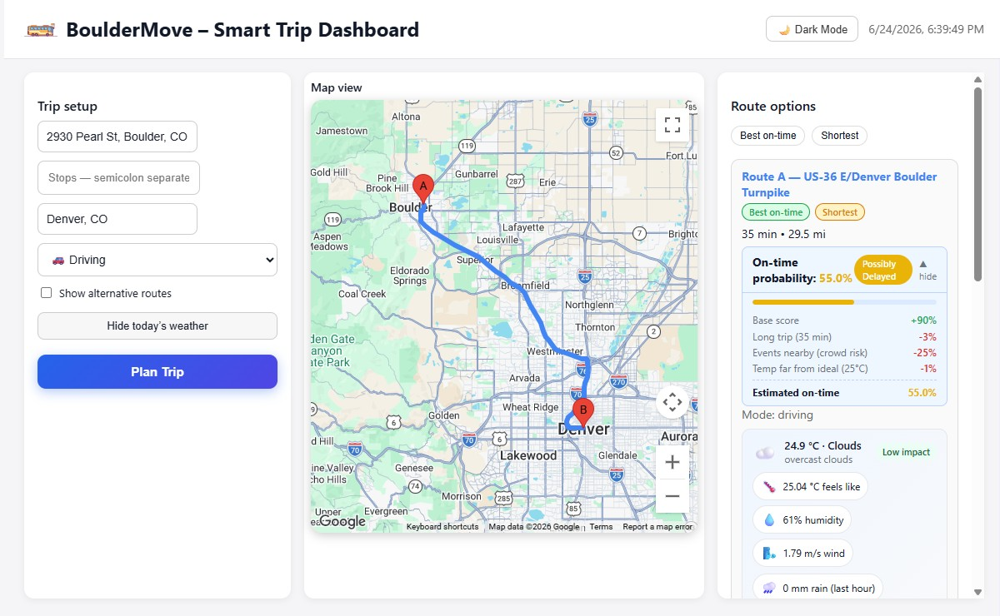
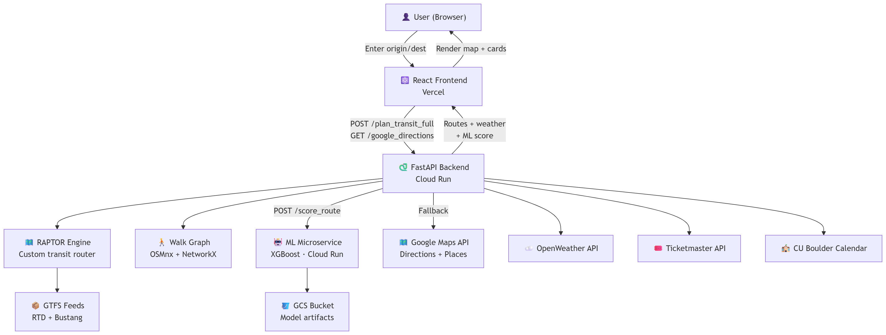

# 🚌 BoulderMove — Smart Multimodal Trip Planner

**Live demo → [bouldermove.vercel.app](https://bouldermove.vercel.app)**

BoulderMove is a full-stack trip planning app for Boulder, CO that combines real-time transit routing, live weather context, local event awareness, and an XGBoost ML model to predict whether your trip will arrive on time — all in one dashboard.

---

## What Makes This Interesting

Most routing apps just find the fastest path. BoulderMove layers on:

- **Custom RAPTOR transit engine**: implements the RAPTOR algorithm from scratch over RTD + Bustang GTFS feeds, 790k+ rows of stop times
- **Walk graph routing**: OSMnx-built pedestrian graph (38MB) with NetworkX shortest-path for walk-to-stop and stop-to-destination legs
- **XGBoost on-time prediction**: ML model trained on 6,000 synthetic trips using weather, transfer count, trip duration, time of day, and event proximity as features
- **Explainable ML breakdown**: each factor's penalty is shown to the user (rush hour −8%, snow −12%, etc.), mirroring the training formula
- **Live context**: OpenWeather API for current conditions, Ticketmaster + CU Boulder Calendar for nearby events
- **Google Transit fallback**: if RAPTOR finds no journey, the backend falls back to Google Directions API silently

---

## System Architecture

---

## Tech Stack

| Layer | Technology |
|---|---|
| Frontend | React, @react-google-maps/api, Lottie |
| Backend | Python, FastAPI, uvicorn |
| Transit routing | Custom RAPTOR algorithm, GTFS (RTD + Bustang) |
| Walk routing | OSMnx, NetworkX, GeoPandas |
| ML model | XGBoost, scikit-learn, trained on synthetic data |
| Deployment | Google Cloud Run (backend + ML), Vercel (frontend) |
| Model storage | Google Cloud Storage |
| APIs | Google Maps (Directions, Places, Maps JS), OpenWeather, Ticketmaster, CU Calendar |

---

## Key Features

- **Multimodal routing** — driving, walking, cycling, transit (walk → bus → walk)
- **Sort routes** by best on-time probability, shortest duration, or fewest transfers
- **On-time prediction** with SHAP-style breakdown of contributing factors
- **Live weather** with severity-tiered alerts (high / medium / low)
- **Event awareness** — Ticketmaster + CU Boulder events along the route flagged as crowd risk
- **Dark mode**
- **Animated splash screen** with Lottie

---

## Design Decisions

**Custom RAPTOR over Google Transit** — Google Transit doesn't expose raw stop-level data. RAPTOR gives full control over routing logic, supports Bustang (regional CO buses), and produces transfer count + leg durations as ML features.

**XGBoost for on-time prediction** — Gradient boosting handles tabular features (duration, weather, transfers) without much tuning. Training on 6,000 synthetic trips with an interpretable formula makes predictions explainable by design.

**Two separate Cloud Run services** — The ML microservice (XGBoost + GCS model download) is isolated from the routing backend so each can scale and cold-start independently. Both run with `--min-instances 1` to stay warm for demos.

---

## What I'd Do Differently

**GTFS-RT for live bus positions** — Departure times are currently pulled from the static GTFS schedule. Integrating RTD's GTFS Realtime feed would show actual live delays on the map, making the routing truly real-time.

**Persistent trip history** — No database backs the app right now. Adding a lightweight store would allow saving and comparing past trips over time.

---

